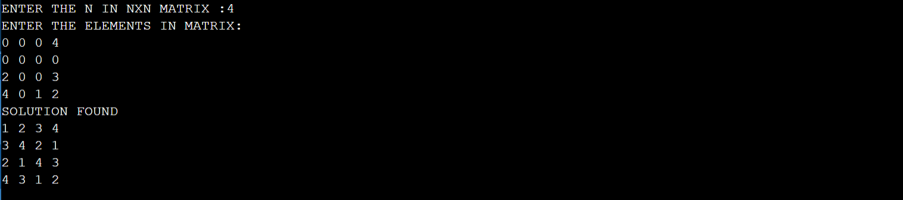
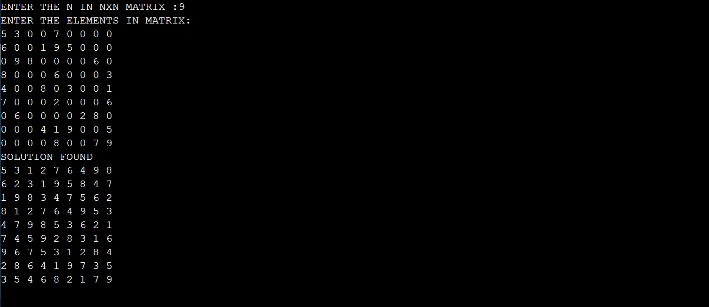

# SUDOKU
A Sudoku solver program capable of finding solutions for given Sudoku puzzles.

Suduko has two phases one is creating and other is answering for nxn matrix

In answering also we may have two parts one is single answer and other is multiple answers

In those first part is finding single answer is completed

for 4x4

for 9x9

like same it will works for all nxn matrices

THANKYOU 
